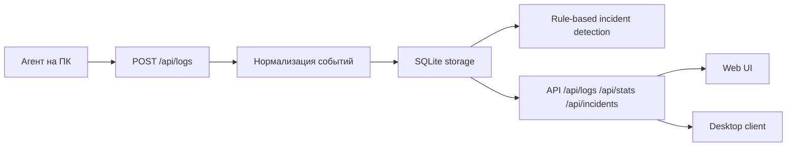

# BARSUKSIEM

BARSUKSIEM - система централизованного аудита журналов событий удаленных персональных компьютеров для контроля информационной безопасности.

## Назначение

Проект собирает события с Linux и Windows, нормализует их, сохраняет в SQLite, выявляет типовые инциденты ИБ и предоставляет web-интерфейс и desktop-клиент для анализа.

## Ключевые возможности

- централизованный прием логов от агентов
- нормализация событий из разных источников
- поиск и фильтрация по журналам и инцидентам
- rule-based выявление инцидентов ИБ
- статистика, аналитика, отчеты и инвентаризация
- session-based аутентификация и CSRF-защита
- аудит действий пользователей
- smoke и integration tests для ключевых сценариев

## Архитектура



### Компоненты

- `main.py` - CLI entrypoint для режимов `server`, `agent`, `client`
- `server/app_factory.py` - сборка FastAPI приложения через `create_app`
- `server/routes/` - API и page routes по зонам ответственности
- `server/auth.py` - пользователи, сессии, audit log, bootstrap admin
- `server/storage.py` - SQLite хранилище событий и инцидентов
- `server/parser.py` - нормализация входных событий
- `server/incidents.py` - правила выявления инцидентов
- `client/agent.py` - сбор логов на машине-источнике
- `client/connection.py` - desktop-клиент для работы с защищенным API
- `web/` и `web/static/` - web UI

## Канонические API маршруты

- `POST /api/logs`
- `GET /api/logs`
- `GET /api/stats`
- `GET /api/incidents`
- `GET /api/incidents/stats`
- `GET /api/incidents/rules`
- `GET /api/agents/stats`
- `POST /api/auth/login`
- `POST /api/auth/logout`
- `GET /api/auth/me`
- `GET /api/audit`

Совместимые legacy aliases сохранены для части маршрутов, но в документации и клиентах следует использовать именно `/api/...`.

## Быстрый старт

Если вам нужна полная инструкция "для чайника" под 3 отдельные Linux ВМ, используйте [ИНСТРУКЦИЯ_3_VM_LINUX.md](/E:/МТУСИ%202025-2026/Диплом/ПО/ИНСТРУКЦИЯ_3_VM_LINUX.md).

### Сервер

```bash
python -m pip install -U pip
python -m pip install -U -r requirements-server.txt
python main.py server --host 0.0.0.0 --port 8080
```

### Агент

```bash
python -m pip install -U pip
python -m pip install -U -r requirements-client.txt
python main.py agent --server http://127.0.0.1:8080 --source auto --interval 60
```

### Desktop client

```bash
python main.py client --server http://127.0.0.1:8080
```

### Web UI

Откройте `http://127.0.0.1:8080/login` и войдите под bootstrap-учетной записью.

## Bootstrap admin и аутентификация

При первом запуске на пустой базе создается bootstrap-администратор.

- Рекомендуемый способ: задать `BARSUKSIEM_BOOTSTRAP_ADMIN_USERNAME` и `BARSUKSIEM_BOOTSTRAP_ADMIN_PASSWORD`.
- Если пароль не задан, сервер создаст bootstrap admin автоматически и выведет пароль в startup log.
- Default hardcoded admin в проекте больше не используется.
- После входа создается session cookie; защищенные POST/PUT/DELETE запросы используют `X-CSRF-Token`.
- `GET /api/auth/me` возвращает текущего пользователя и обновляет CSRF token через response header.

## Переменные окружения

- `CORS_ALLOWED_ORIGINS` - разрешенные origin через запятую
- `BARSUKSIEM_COOKIE_SECURE` - включает secure cookie
- `BARSUKSIEM_COOKIE_SAMESITE` - значение SameSite для session cookie
- `BARSUKSIEM_SESSION_MAX_AGE` - lifetime session cookie в секундах
- `BARSUKSIEM_BOOTSTRAP_ADMIN_USERNAME` - login bootstrap admin
- `BARSUKSIEM_BOOTSTRAP_ADMIN_PASSWORD` - пароль bootstrap admin
- `BARSUKSIEM_DEMO_MODE` - включает demo-oriented режим запуска
- `BARSUKSIEM_CLIENT_USERNAME` - login для desktop-клиента
- `BARSUKSIEM_CLIENT_PASSWORD` - пароль для desktop-клиента

## Web-разделы

- `/` - overview и аудит
- `/logs` - журналы событий
- `/incidents` - список инцидентов
- `/incidents/details?id=...` - карточка инцидента
- `/analytics` - отчеты и аналитика
- `/inventory` - удаленные ПК
- `/compliance` - audit/compliance представление

## Smoke-сценарий для защиты

1. Запустить сервер: `python main.py server --host 0.0.0.0 --port 8080`
2. Открыть `/login` и войти под bootstrap admin
3. Запустить агента: `python main.py agent --server http://127.0.0.1:8080 --source file --interval 60`
4. Проверить появление событий в `/logs`
5. Проверить инциденты в `/incidents`
6. Проверить сводную картину в `/` и `/analytics`
7. Подтвердить воспроизводимость тестами: `python -m unittest discover -s tests -v`

## Проверка

Текущий набор автоматических тестов покрывает:

- login / me / logout
- защищенный доступ к `/api/stats`
- ingest логов через `/api/logs`
- чтение `/api/logs` и `/api/incidents`
- parser normalization
- базовые incident rules

## Документация проекта

- `ИНСТРУКЦИЯ_3_VM_LINUX.md` - главный подробный гайд по развертыванию на 3 Linux ВМ
- `API_ДОКУМЕНТАЦИЯ.md` - API и wire contracts
- `ИНСТРУКЦИЯ.md` - короткий указатель на главный гайд
- `РАЗМЕЩЕНИЕ_ФАЙЛОВ_И_ЭКСПЛУАТАЦИЯ.md` - краткая памятка по составу файлов и эксплуатации
- `БЕЗОПАСНОСТЬ.md` - механизмы ИБ
- `МОДЕЛЬ_УГРОЗ.md` - актуальная threat model
- `ПРАВИЛА_ИНЦИДЕНТОВ.md` - реализованные правила выявления
- `ОТЧЕТ_О_РАБОТЕ.md` - сводный технический отчет
- `РЕВЬЮ_КОДА.md` - закрытые замечания и текущий техдолг
- `РЕКОМЕНДАЦИИ_LINUX.md` - рекомендации по запуску на Linux
- `СЦЕНАРИЙ_LINUX.md` - Linux demo-flow
