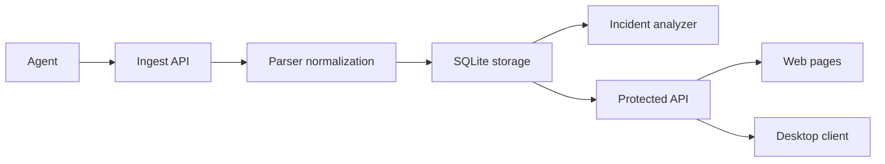

# Отчет о проделанной работе по проекту BARSUKSIEM

## 1. Назначение и результат

BARSUKSIEM реализует систему централизованного аудита журналов событий удаленных ПК с акцентом на задачи информационной безопасности, расследования и контроля активности.

Итог текущей версии:

- есть рабочий сервер на FastAPI
- есть агент сбора логов
- есть web UI и desktop-клиент
- есть нормализация событий, хранение, инциденты, статистика и audit log
- есть базовое тестовое покрытие ключевых сценариев

## 2. Архитектура системы

### Текущая структура

- `main.py` - единый CLI entrypoint
- `server/app_factory.py` - сборка приложения
- `server/routes/` - auth, logs, incidents, stats, pages
- `server/auth.py` - пользователи, сессии, audit log, bootstrap admin
- `server/storage.py` - SQLite persistence
- `server/parser.py` - normalization layer
- `server/incidents.py` - rules engine
- `client/agent.py` - сбор логов
- `client/connection.py` - desktop API client
- `web/static/` - frontend scripts и shared helpers

## 3. Реализованные функции

### Сервер

- прием логов через `/api/logs`
- защищенный доступ к `/api/logs`, `/api/stats`, `/api/incidents`, `/api/audit`
- app factory и разбиение маршрутов по модулям
- кэширование выборок и инвалидация по prefix
- статистика по событиям, инцидентам и агентам

### Безопасность

- bcrypt и password policy
- session cookie и CSRF protection
- rate limiting для login и ingest
- security headers middleware
- bootstrap admin без hardcoded пароля
- audit log пользовательских действий

### Клиенты

- web UI для логов, инцидентов, аналитики, compliance и inventory
- desktop-клиент с login в защищенный API
- агент для Linux/Windows и file-based ingest

### Анализ инцидентов

Реализованы правила `R001-R005`, включая brute force, night admin login, suspicious PowerShell activity, log tampering и privilege escalation.

## 4. Что улучшено в текущем цикле доработки

- API унифицирован под `/api/...`
- auth и CSRF flow приведены к одному сценарию
- frontend получил общий helper-слой вместо повторяющихся auth/logout/fetch блоков
- серверный монолит разрезан на route-модули
- документация синхронизирована с фактическим состоянием проекта
- добавлены unit и integration tests

## 5. Что подтверждено тестами

Автотесты подтверждают:

- login / me / logout
- отказ logout без CSRF token
- ingest demo логов
- чтение `/api/logs`, `/api/stats`, `/api/incidents`
- корректную parser normalization
- срабатывание основных incident rules

## 6. Практическая значимость

Проект можно использовать как:

- учебную SIEM-подобную систему
- демонстрацию навыков backend, security и incident handling
- основу для дипломной защиты по теме аудита и контроля ИБ

## 7. Перспективы развития

- переход с SQLite на PostgreSQL
- вынос ingest и correlation в отдельные worker-процессы
- расширение набора детектирующих правил
- добавление оповещений и уведомлений
- улучшение отчетности и управления ролями
- расширение тестового покрытия и нагрузочных сценариев

## 8. Вывод

На текущем этапе BARSUKSIEM представляет собой не заготовку, а работоспособную систему с внятной архитектурой, базовыми механизмами защиты, воспроизводимым demo-сценарием и документированной логикой работы.
